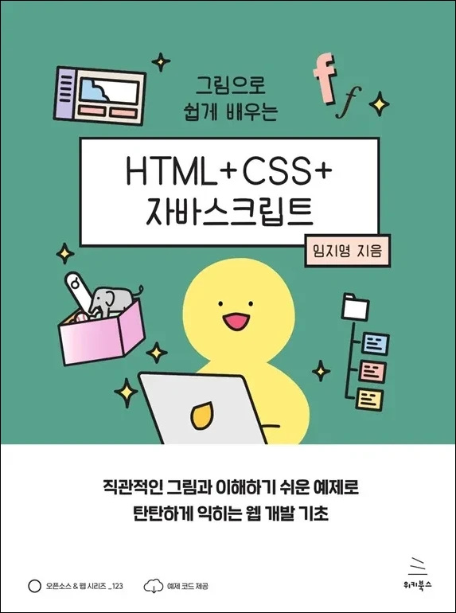

# 그림으로 쉽게 배우는 HTML+CSS+자바스크립트
### 직관적인 그림과 이해하기 쉬운 예제로 탄탄하게 익히는 웹 개발 기초

- **임지영** 지음
- ISBN: 9791158396152
- 판형: 175\*235\*19mm
- 27,000원 | 2025년 9월 10일 발행 | 452쪽
- [책 홈페이지](https://wikibook.co.kr/hcj/)
- [도서 미리보기](http://www.yes24.com/Product/Viewer/Preview/152847458)
- [도서 관련 문의](https://wikibook.co.kr/support/contact/)

---

**처음 배우는 웹 개발, 그림과 예제로 HTML부터 자바스크립트까지 탄탄하게 익히세요!**

웹 개발을 처음 배우려고 할 때 가장 먼저 드는 생각은 “대체 어디서부터 시작해야 하지?”입니다. 낯선 용어, 익숙하지 않은 코드, 구조를 이해하기 어려운 화면 구성 등 초보자 입장에서 웹 개발을 배우는 일은 쉽지 않습니다.

『그림으로 쉽게 배우는 HTML+CSS+자바스크립트』는 이러한 고민을 가진 분들을 위해 만들어진 책입니다. 웹 페이지의 뼈대를 구성하는 HTML, 스타일을 담당하는 CSS, 동적인 기능을 구현하는 자바스크립트까지, 웹 개발의 핵심 기술을 그림과 실생활 비유를 활용해 누구나 이해하기 쉽게 풀어냈습니다.

처음 개발 도구를 설치하는 것부터 시작해, 직접 따라 해보는 실습을 통해 기초 개념을 자연스럽게 익히고, 나만의 웹 페이지를 완성해보는 실전 프로젝트로 실력을 탄탄히 다질 수 있습니다. 각 단원마다 핵심 용어 정리와 간단한 연습 문제가 함께 구성돼 있어 앞에서 배운 내용을 다시 한번 확인하며 익힐 수 있습니다. 또한 마지막 장에서는 웹 접근성, API, 프런트엔드 라이브러리 등 한 단계 더 성장할 수 있는 학습 방향도 제시합니다.

웹 개발을 처음 시작했거나 이제 막 흥미를 느끼기 시작한 예비 개발자에게 이 책은 가장 든든한 첫걸음이 되어 줄 것입니다.

**★ 이런 분들께 추천합니다! ★**

- 처음 웹 개발을 배우는 입문자
- HTML, CSS, 자바스크립트 기초를 한 번에 익히고 싶은 분
- 그림과 실습 예제로 이해하는 것을 좋아하는 학습자

---
 
 ## 구입처
 
 - [예스24](https://www.yes24.com/product/goods/152847458)
 - [교보문고](https://product.kyobobook.co.kr/detail/S000217447857)
 - [알라딘](https://www.aladin.co.kr/shop/wproduct.aspx?ItemId=371141912)
 - [쿠팡](https://www.coupang.com/vp/products/9031931099?itemId=26493638134)
